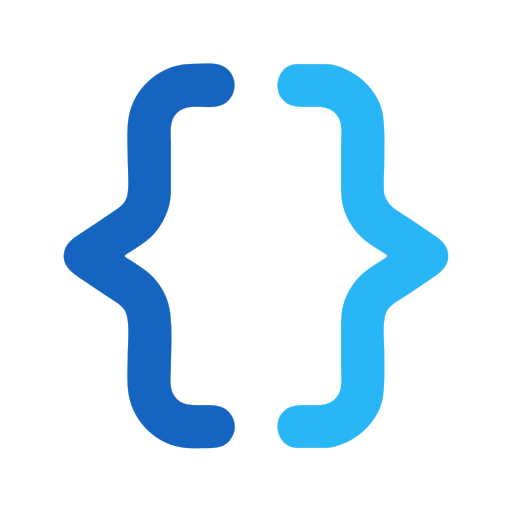

<p align="center">
  
</p>

<h1 align="center">Portfolio-Website</h1>

<p align="center">
  <a href="https://noelkohn.ch" target="_blank">noelkohn.ch</a>
</p>

Die Portfolio-Website entstand im Rahmen meines Bewerbungsverfahrens an der IMS. Sie stellt meine bisherigen Informatikprojekte vor und bietet ausgewählten Personen Zugriff auf zusätzliche Informationen, meinen Lebenslauf, Zeugnisse und weitere Ausbildungsnachweise.

Öffentliche Inhalte und persönliche Bewerbungsunterlagen sind bewusst voneinander getrennt. Projekte können ohne Anmeldung betrachtet werden, während persönliche Seiten und Dokumente ein Benutzerkonto voraussetzen.

<p align="center">
  
</p>

## Inhaltsübersicht

- [Funktionsumfang](#funktionsumfang)
- [Projektaufbau](#projektaufbau)
- [Architektur](#architektur)
- [Technologien](#technologien)
- [Voraussetzungen](#voraussetzungen)
- [Lokale Entwicklung](#lokale-entwicklung)
- [Datenbank und Testkonten](#datenbank-und-testkonten)
- [API](#api)
- [Sicherheit](#sicherheit)
- [Deployment](#deployment)

## Funktionsumfang

### Öffentliche Portfolio-Seite

- Startseite mit Kurzvorstellung und Kontaktmöglichkeiten
- Übersicht über ausgewählte Informatikprojekte
- Projektkarten mit Beschreibung, Zeitraum und Technologien
- Detailansichten mit Bildergalerien und weiterführenden Links
- automatisch nachgeladene Projekte beim Scrollen
- Impressum und Datenschutzhinweise

### Geschützter Bewerbungsbereich

- Anmeldung mit einem Benutzerkonto
- Informationen über Erfahrungen und Kompetenzen
- Darstellung verwendeter Technologien nach Kategorien
- persönliche Hobbyseite
- Lebenslauf, Zeugnisse und Kompetenznachweise als PDF
- einzelne Dokumente im Browser öffnen oder herunterladen

### Administration

- getrennte Anmeldung für Administratoren
- Benutzer erstellen, bearbeiten, aktivieren und deaktivieren
- Projekte inklusive Titelbild, Galerie, Tags und Links verwalten
- Projekte veröffentlichen oder aus der öffentlichen Ansicht entfernen
- Inhalte der «Über mich»- und Hobbyseiten bearbeiten
- Bewerbungsunterlagen und Projekt-Abstracts hochladen
- Übersicht über Benutzer

## Projektaufbau

```text
.
+-- frontend/                 # Öffentliche React-Anwendung
+-- admin-frontend/           # Separate Administrationsoberfläche
+-- backend/                  # NestJS-Backend
|   +-- prisma/               # Datenbankschema, Migrationen und Seed
|   +-- src/                  # Öffentliche und administrative API
|   +-- uploads/              # Öffentliche Projektdateien zur Laufzeit
|   +-- private-storage/      # Geschützte Dokumente und Hobbybilder
+-- .github/workflows/        # Erstellung der Container-Images
+-- docker-compose.deploy.yml # Produktive Docker-Umgebung
+-- .env.example              # Vorlage für Deployment-Variablen
+-- README.md
```

## Architektur

Das Projekt besteht aus zwei Frontends und einem Backend mit zwei getrennten Einstiegspunkten:

```text
Besucher                              Administrator
   |                                       |
   v                                       v
Portfolio-Frontend                  Admin-Frontend
   |                                       |
   | REST-API                              | Admin-API
   v                                       v
Öffentliches Backend :3000          Admin-Backend :3001
   |                                       |
   +-------------------+-------------------+
                       |
                       v
                Prisma und MariaDB
                       |
             +---------+----------+
             |                    |
      Öffentliche Dateien   Geschützte Dateien
```

Das öffentliche Backend liefert veröffentlichte Projekte aus und stellt nach einer erfolgreichen Anmeldung die geschützten Portfolio-Inhalte bereit. Das Admin-Backend übernimmt die Verwaltung der Inhalte und Benutzer. Beide greifen über Prisma auf dieselbe MariaDB-Datenbank zu, verwenden jedoch getrennte Benutzerkonten.

## Technologien

| Bereich | Technologien |
| --- | --- |
| Frontend | React 19, TypeScript, Vite, React Router, React Icons, CSS Modules |
| Backend | Node.js, NestJS 11, Prisma, Class Validator |
| Datenbank | MariaDB 11 |
| Authentifizierung | JWT und Argon2id |
| Infrastruktur | Docker Compose, Nginx, Cloudflare Tunnel |
| Automatisierung | GitHub Actions und GitHub Container Registry |

## Voraussetzungen

Für die lokale Entwicklung werden folgende Programme benötigt:

- Node.js 24 oder eine kompatible aktuelle Version
- pnpm 10
- Docker mit Docker Compose
- Git

## API

Alle Schnittstellen verwenden das Präfix `/api/v1`.

### Öffentliche Schnittstellen

| Bereich | Endpunkte |
| --- | --- |
| Anmeldung | `/auth/login` |
| Projekte | `/projects` |
| Persönliche Informationen | `/about` |
| Hobbys | `/hobbies`, `/hobbies/:id/image` |
| Dokumente | `/docs`, `/docs/:id/view.pdf`, `/docs/:id/download.pdf` |

Veröffentlichte Projekte sind ohne Anmeldung verfügbar. Persönliche Informationen, Hobbys und Bewerbungsunterlagen benötigen ein gültiges Besucher-Token.

## Sicherheit

- Besucher und Administratoren besitzen getrennte Konten und JWT-Schlüssel.
- Passwörter werden mit Argon2id gehasht gespeichert.
- Geschützte API-Endpunkte erwarten ein gültiges Bearer-Token.
- Benutzerkonten können jederzeit deaktiviert oder gelöscht werden.
- Anmeldeversuche und Medienzugriffe werden durch Rate Limits begrenzt.
- Eingaben werden serverseitig validiert; unbekannte Felder werden abgelehnt.